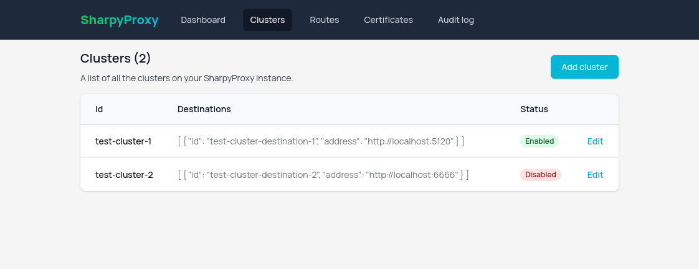

# SharpyProxy
GUI-enabled reverse proxy using [Microsoft's YARP](https://microsoft.github.io/reverse-proxy/) and [Nuxt 3](https://nuxt.com/).

**:warning: The project is in a very early WIP stage and is not yet ready for production usage.**

### Features:
- Clusters management (Load balancing, health checks...)
- Routes management (Authorization, CORS...)
- Certificates management (Manual or automatic with LetsEncrypt)
- Audit log
- Modern and user-friendly dashboard (Nuxt 3, Tailwind)

### Screenshots:

